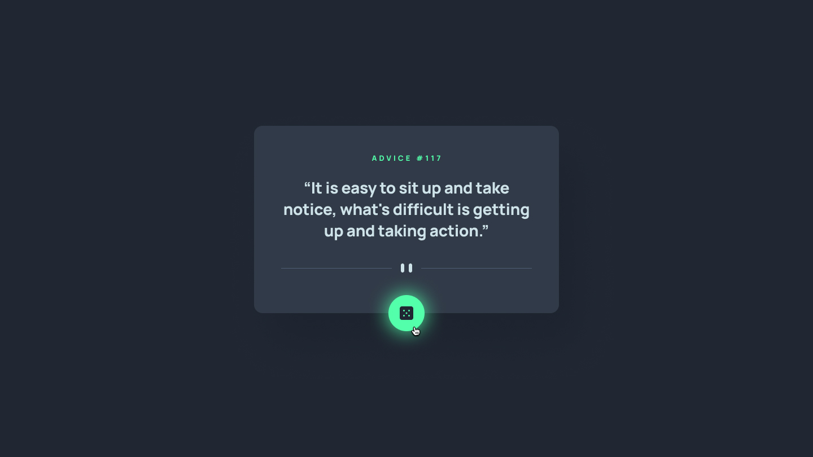

## Table of contents

- [Overview](#overview)
  - [The challenge](#the-challenge)
  - [Screenshot](#screenshot)
  - [Links](#links)
- [My process](#my-process)
  - [Built with](#built-with)
  - [What I learned](#what-i-learned)
- [Author](#author)

## Overview

### The challenge

Users should be able to:

- View the optimal layout for the app depending on their device's screen size
- See hover states for all interactive elements on the page
- Generate a new piece of advice by clicking the dice icon

### Screenshot



### Links

- Live Site URL: [Live site URL here](https://app-advicegenerator.netlify.app/)

## My process

### Built with

- Semantic HTML5 markup
- CSS custom properties
- Flexbox
- CSS Grid
- Mobile-first workflow
- Vanilla JS

### What I learned

```css
@media (hover: hover) {
  &:hover {
    cursor: pointer;
    box-shadow: -0.2rem -0.2rem 2rem 0.3rem $neon-green;
  }
}
```

## Author

- Frontend Mentor - [@iprinceroyy](https://www.frontendmentor.io/profile/iprinceroyy)
- Twitter - [@prince_popups](https://www.twitter.com/@prince_popups)
